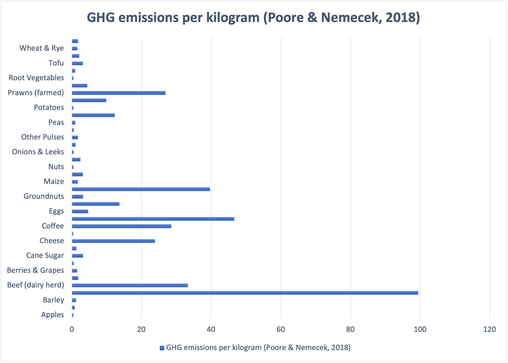

# Final-Project-Part1

## High-Level Summary:

The overarching goal of this project is to illuminate the profound impact of meat production on the global environment and to tell a compelling story that encourages awareness and sustainable choices. The narrative will kick off by pinpointing the world's average meat production and then delve into the average meat consumption per person globally. The project will explore the environmental implications by examining the amount of grass consumed by these animals, shedding light on how our dietary choices impact the planet. Additionally, uncovers the average carbon footprint associated with meat production. Lastly, the project will illustrate changes in carbon dioxide levels, offering a comprehensive view of the interconnected relationship between meat production and environmental shifts.

## Project Structure:
1. **Introduction:**
   - Establishing the overarching goal: to highlight the profound impact of meat production on the global environment.
   - Data prepared to use: How much meat do people eat on average in a year in the US (to raise awareness)

2. **Global Meat Production Overview:**
   - Providing context for the scale of meat production globally.
   - Data prepared to use: Historical data on global meat production, regional breakdown of meat production.

3. **Global Meat Consumption Patterns:**
   - Exploring variations in dietary habits and their implications.
   - Comparative analysis of meat consumption trends over time.
   - Data prepared to use: Average meat consumption per capita globally, regional variations in meat consumption.

4. **Environmental Impact of Meat Consumption:**
   - Examining the ecological consequences by focusing on the amount of grass consumed by animals in meat production.
   - Connecting the link between dietary choices and environmental impact.
   - Data prepared to use: The amount of land/grass required for livestock farming

5. **Carbon Footprint of Meat Production:**
   - Uncovering the average carbon footprint associated with meat production.
   - Exploring the environmental cost of different types of meat.
   - Data prepared to use: Carbon footprint data for different types of meat, data of greenhouse gas emissions from the meat industry.

6. **Illustrating Changes in Carbon Dioxide Levels:**
   - Providing a tangible representation of the environmental shifts resulting from meat production.
   - Data prepared to use: Historical data on carbon dioxide levels, (create a table of the correlation between meat production and carbon dioxide levels if possible)

7. **Conclusion:**
   - Summarizing key insights and findings from the project.
   - Reiterating the importance of raising awareness and making sustainable choices in the context of meat consumption.
   - Share some strategies that NGO or some non-profit group has provided

## Data/Resources and Sketches:
As there is limited of time, these are only a very easy draft of my data visulization
1. **Introduction:**
   - US Department of Agriculture. (February 22, 2023). Per capita meat consumption in the United States in 2022 and 2031, by type (in pounds) [Graph]. In Statista. Retrieved November 21, 2023, from [https://www.statista.com/statistics/189222/average-meat-consumption-in-the-us-by-sort/](https://www.statista.com/statistics/189222/average-meat-consumption-in-the-us-by-sort/)
   - 

2. **Global Meat Production Overview:**
   - OECD, & FAO. (June 7, 2023). Production of meat worldwide from 2016 to 2023 (in million metric tons) [Graph]. In Statista. Retrieved November 21, 2023, from [https://www.statista.com/statistics/237644/global-meat-production-since-1990/](https://www.statista.com/statistics/237644/global-meat-production-since-1990/)
   - [https://ourworldindata.org/meat-production#:~:text=Global%20demand%20for%20meat%20is,agricultural%20land%20and%20freshwater%20use](https://ourworldindata.org/meat-production#:~:text=Global%20demand%20for%20meat%20is,agricultural%20land%20and%20freshwater%20use).
   - 

3. **Global Meat Consumption Patterns:**
   - OECD. (July 30, 2022). Meat consumption worldwide from 1990 to 2021, by meat type* (in million tons) [Graph]. In Statista. Retrieved November 22, 2023, from [https://www.statista.com/statistics/274522/global-per-capita-consumption-of-meat/](https://www.statista.com/statistics/274522/global-per-capita-consumption-of-meat/)
   - 
   - FAO. (January 5, 2023). Production of meat worldwide in 2021, by region (in million metric tons) [Graph]. In Statista. Retrieved November 22, 2023, from [https://www.statista.com/statistics/237547/net-production-of-meat-worldwide-since-1990-by-production-region/](https://www.statista.com/statistics/237547/net-production-of-meat-worldwide-since-1990-by-production-region/)
   - 

4. **Environmental Impact of Meat Consumption:**
   - [https://onpasture.com/2020/02/17/how-many-acres-per-cow-do-you-need/#:~:text=With%20a%20good%20system%20at,you%20will%20need%20more%20acres.] (https://onpasture.com/2020/02/17/how-many-acres-per-cow-do-you-need/#:~:text=With%20a%20good%20system%20at,you%20will%20need%20more%20acres.)
   - Plan to draw a graph with canva with a cow and the amount of land/grass they need
  
5. **Carbon Footprint of Meat Production:**
   - [https://ourworldindata.org/food-choice-vs-eating-local](https://ourworldindata.org/food-choice-vs-eating-local)
   - (There is a data visulization in this website, and I'm still trying to get the actual data from the website)
   - [https://www.dw.com/en/fact-check-is-eating-meat-bad-for-the-environment/a-63595148#:~:text=According%20to%20FAO%20data%2C%2014.5,CO2%20in%20driving%20global%20warming.] (https://www.dw.com/en/fact-check-is-eating-meat-bad-for-the-environment/a-63595148#:~:text=According%20to%20FAO%20data%2C%2014.5,CO2%20in%20driving%20global%20warming.)
   - [https://ourworldindata.org/environmental-impacts-of-food](https://ourworldindata.org/environmental-impacts-of-food)
   - 

6. **Illustrating Changes in Carbon Dioxide Levels:**
   - [https://www.statista.com/statistics/1091926/atmospheric-concentration-of-co2-historic/](https://www.statista.com/statistics/1091926/atmospheric-concentration-of-co2-historic/)
   - 

## Method and medium
I planned to done my final presentation by canva as I'm familar of how to use it. But I will still explore Shorthand and see at the end if it's more sutible for my project.

